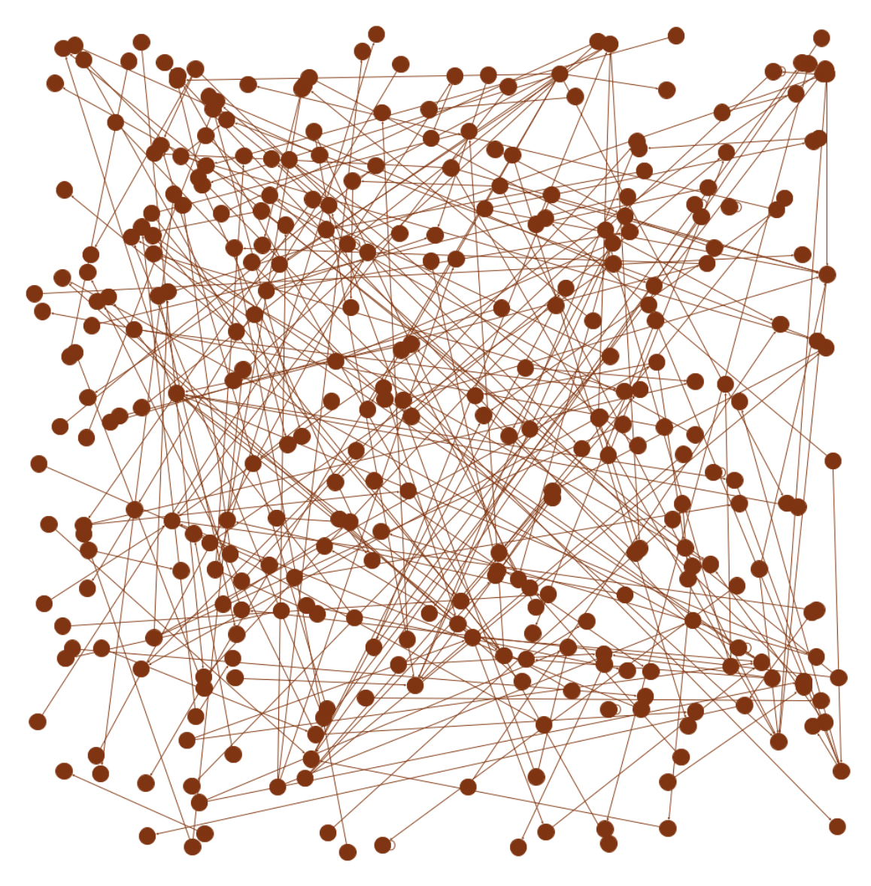
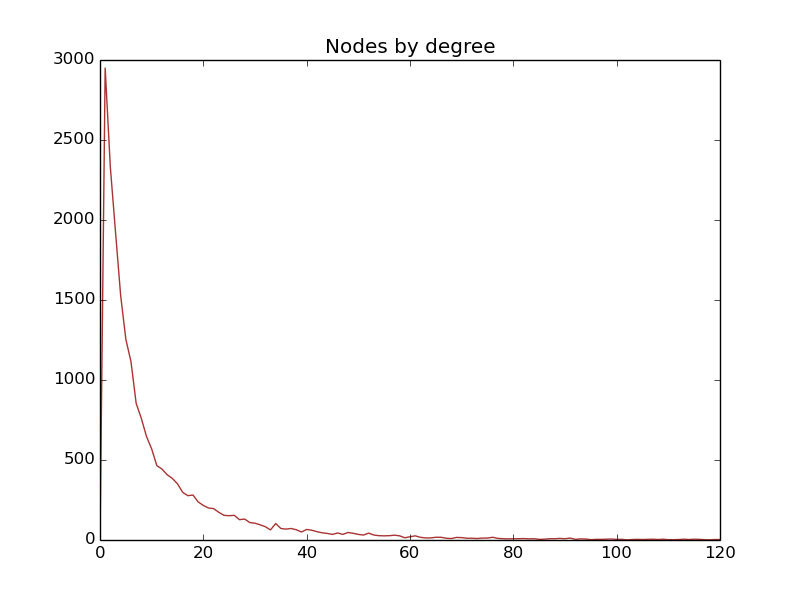
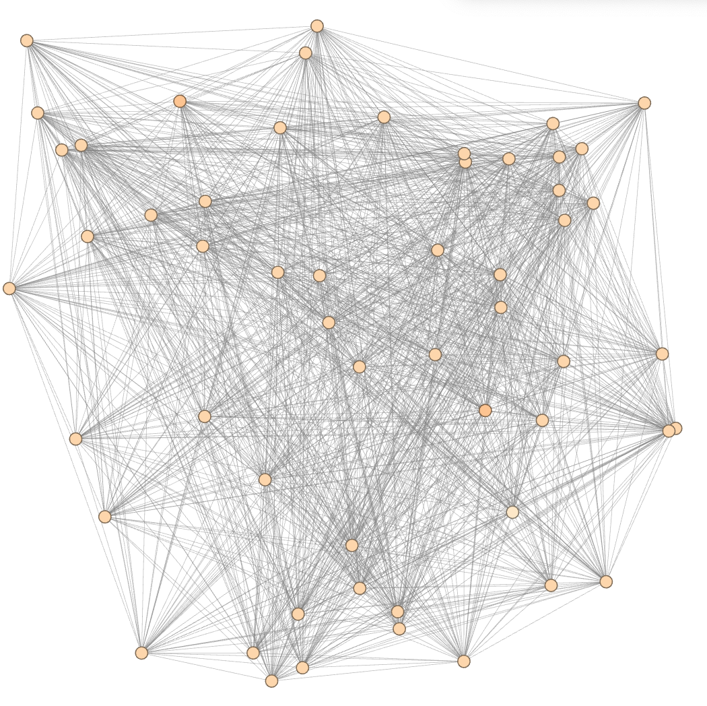
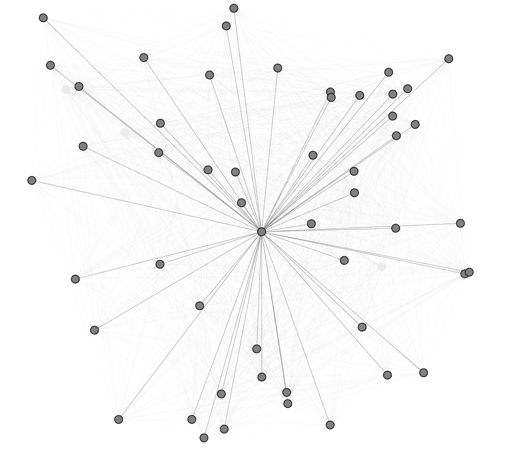
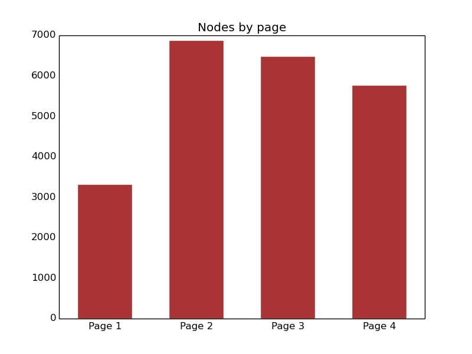

#### [Abstract](index.md)            [Process and Insights](process.md)            [Visualizations](visuals.md)            [Next Steps](nextsteps.md)

 

# Findings

 

A typical random induced subgraph of the overall graph

Degree histogram

 

Nodes with degree > 37

 

A popular node

 

Page type histogram

 

edges by characterists